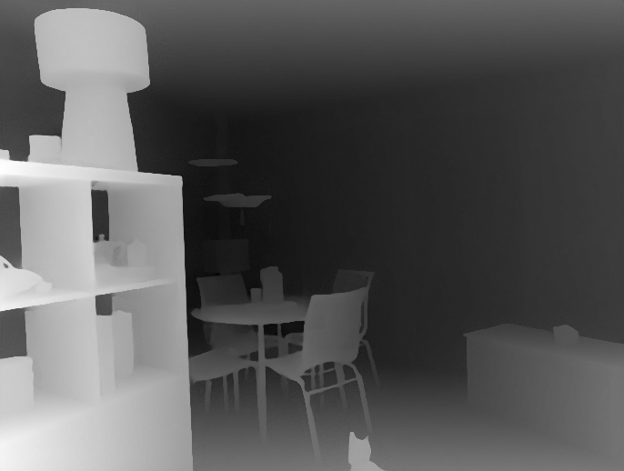

# Lens learned-depth checkpoint — 2026-10-10

Issue [#172](https://github.com/twangyal/projects-monorepo/issues/172) remains **open**. Lens's photo-simulation destination needs automatic scene depth; manual authoring is useful but does not deliver that capability. This checkpoint establishes genuine local inference and preserves a reproducible starting point. It does not enable a model in the application or establish product readiness.

## Candidate and provenance

- [Depth Anything V2 upstream](https://github.com/DepthAnything/Depth-Anything-V2) declares the **Small** weights Apache-2.0. Base/Large/Giant use CC-BY-NC-4.0; their terms must not be substituted. The [paper, section5.2](https://arxiv.org/html/2406.09414v2) describes affine-invariant inverse depth. Larger raw values indicate nearer regions, but values are not calibrated meters or the editor's existing relative distances.
- [ONNX quantized conversion](https://huggingface.co/onnx-community/depth-anything-v2-small/blob/c70d1ddbcd93c9bda8098268cc3554adf5e8dd4f/onnx/model_quantized.onnx), revision `c70d1ddbcd93c9bda8098268cc3554adf5e8dd4f`: actual27,258,801bytes, published and locally verified SHA256 `fcf51f1b230362b28690bb9d1809bf0431f29cad20534e3f589bd7285547f20d`. The conversion card declares Apache-2.0. Model bytes are downloaded for evaluation and are not bundled into the repository/product.
- The retained [preprocessor configuration](https://huggingface.co/onnx-community/depth-anything-v2-small/resolve/c70d1ddbcd93c9bda8098268cc3554adf5e8dd4f/preprocessor_config.json) is byte-identical to that revision: SHA256 `03576db3c13dd0471fdf5f5e1428befcb95de063fe699879150b293dc9e0a2c6`. RGB rescaling/normalization, bicubic resize, preserved aspect and nearest14-pixel dimensions follow its declared DPT configuration. The dimension rule was checked against [Transformers v4.57.1 DPT source](https://github.com/huggingface/transformers/blob/v4.57.1/src/transformers/models/dpt/image_processing_dpt.py), downloaded source SHA256 `6d969ca3a0c6ed7ed44ad748e5ee568ec97d67cd984f868dabc88d6706710def`. This small independent harness is not a full Transformers parity test.
- Real input: [The living room that needs houseplants](https://commons.wikimedia.org/w/index.php?title=File:The_living_room_that_needs_houseplants.jpg&oldid=1145910283), by **Lo / L's pets & stuff**, CC0-1.0, dated2015-04-19 on its source page. Actual4,194,091-byte JPEG,3264×2448, SHA256 `159a97446c8744093ead5306c69df7dae7e77f613782cb0365f7b420b8293eae`. License/provenance checked2026-10-10. No private user photo was used.

## Frozen smoke and actual results

[frozen-smoke.json](frozen-smoke.json) fixes five visual near/far judgments, source/model hashes, sampling and the unpainted baseline before any inference. Its exact hash and resulting raw samples are retained in [smoke-result.json](smoke-result.json). [The pre-inference issue comment](https://github.com/twangyal/projects-monorepo/issues/172#issuecomment-6096210874) records the fixed protocol before the inference outputs. There was no post-output threshold, point or model tuning.

Three real CPU inferences in one process produce identical raw float-output hashes. A [separate reviewer’s fresh-process rerun](independent-rerun.json) reproduces the raw hashes, preview hash and every pair value exactly; its907–997ms observations are separate from the primary measurements. Post-output review of the original photo found the ordinal descriptions plausible, but does not turn them into independent frozen ground truth. With Python3.12.14, ONNX Runtime1.23.2 CPUExecutionProvider, NumPy2.3.5, Pillow12.3.0, x86_64, four intra-op/one inter-op threads, inference times are **1090.24,1057.96,989.79ms**; session loading is489.75ms. Linux peak process RSS is604,948KiB. These single-machine observations are not universal latency, memory or browser guarantees.

The1280×960 normalized photo becomes `[1,3,518,686]` model input and `[1,518,686]` raw inverse-depth output. All five predeclared strict ordinal comparisons pass; an unpainted all-subject mask ties all five and scores0/5 under this rule. This comparison does not evaluate manually authored masks. [inference.log](inference.log) retains literal output; [wrong-artifact-refusal.log](wrong-artifact-refusal.log) retains a checksum refusal of the actual first1024-byte download probe before model loading or result creation.



The visualization is a display scaling of real raw output, not calibrated distance. The one implementer's ordinal judgments are not independent measured ground truth. One already-public photo could overlap model training and does not establish generalization, thin-boundary quality, useful perspective output or reduced correction effort. Pillow normalization also differs from the current browser's photo normalization.

## Reproduce without paid services

Use a separate Python environment; these packages are research dependencies, not app dependencies. The measured versions are retained in `requirements-measured.txt`. The harness uses only local files and CPU inference; it makes no network requests or automatic downloads.

```sh
python -m venv /tmp/lens-depth-env
/tmp/lens-depth-env/bin/python -m pip install -r docs/research/lens-depth-baseline/requirements-measured.txt
curl --fail --location --max-time 60 -o /tmp/lens-depth-model.onnx https://huggingface.co/onnx-community/depth-anything-v2-small/resolve/c70d1ddbcd93c9bda8098268cc3554adf5e8dd4f/onnx/model_quantized.onnx
curl --fail --location --max-time 30 -o /tmp/lens-depth-room.jpg https://upload.wikimedia.org/wikipedia/commons/e/ed/The_living_room_that_needs_houseplants.jpg
timeout 90 /tmp/lens-depth-env/bin/python docs/research/lens-depth-baseline/evaluate.py --model /tmp/lens-depth-model.onnx --preprocessor docs/research/lens-depth-baseline/preprocessor_config.json --photo /tmp/lens-depth-room.jpg --output /tmp/lens-depth-result.json
```

Every artifact is checksum-checked before the model session. A changed source download is refused; review provenance deliberately rather than changing expected hashes to admit unknown bytes. The90-second external process bound and fixed inputs limit this experiment; they are not a product cancellation implementation. Arbitrary user photos/models are not an admitted harness input.

## Remaining milestone

1. Freeze a diverse legally reusable real-photo set with independently reviewed ordinal and subject-boundary labels, including difficult transparency/reflection/thin objects, and a correction-effort task before tuning.
2. Compare a candidate on held-out photos and actual perspective-edit results; preserve errors and establish whether corrections are manageable. No success threshold is inferred from this five-pair smoke.
3. Evaluate a real browser runtime, explicit local model acquisition/license disclosures, progress/cancellation, resource use and stale-result protection. Do not replace worker/storage safeguards with synchronous inference.
4. Design inspectable editable depth and subject anchoring without treating affine inverse values as physical distance. The existing three-plane schema/kernel will need a deliberate extension or disclosed proposal mapping, followed by end-to-end export/recovery evaluation.
5. Decide whether integration is warranted; generated missing surfaces remain a separate capability.

Artifact access is available; this milestone is **unfinished**, not blocked by missing weights. Lens and the portfolio remain ACTIVE under the revised product direction. No paid service, uploaded private image or product model integration was introduced.

## Broader frozen evaluation

The [two-photo extension](extension-2026-10-10/README.md) adds independent pre-output image-only labels, actual portrait/street inference, retained difficult-case failures and same-host repeatability. All10 clear comparisons pass, but the overhead wire ties sky; sparse diagnostics are not boundary accuracy. The original smoke remains unchanged. The harness now admits additional explicitly checksummed protocols with coordinate bounds; broader correction-effort, browser and integration work remains open in #172.

The [actual Chromium/WASM probe](browser-2026-10-10/README.md) executes repeatable portrait inference with an interactive main thread, but retains a failed500ms native worker-retirement gate and measured CPU/WASM differences. Independent diagnosis observed delayed target destruction before browser close, not a persistent leak. Browser preprocessing, resources, boundary/correction utility and editable-depth integration remain open; no product model is enabled.

The [frozen anchored-subject diagnostic](boundary-2026-10-10/README.md) uses a fresh source-only coarse silhouette reference and the existing portrait depth preview. A fixed anchored depth band retains connected background: IoU0.47368,28,586 binary label flips versus27,447 for empty. This synthetic proxy does not measure human effort or held-out quality and does not justify automatic subject replacement. The output and failures remain inspectable; subject/continuous-depth design and actual useful edits remain unfinished.
