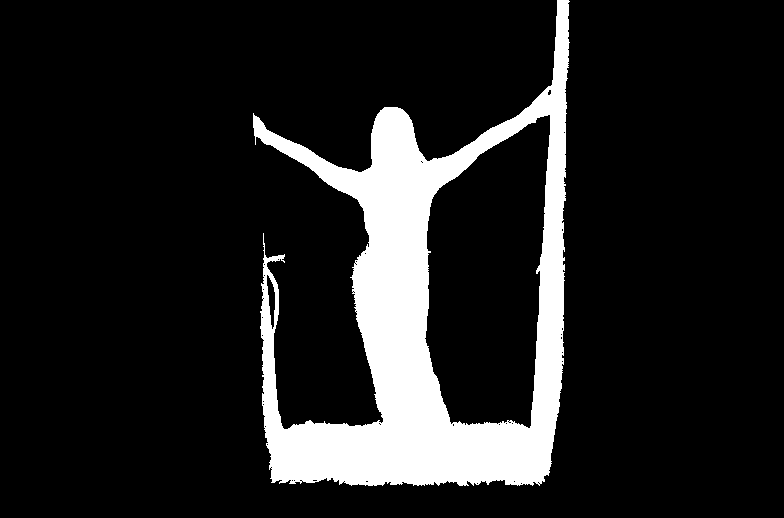

# Anchored subject diagnostic — 2026-10-10

[#172](https://github.com/twangyal/projects-monorepo/issues/172) remains open. Lens needs useful editable depth and subject anchoring, alongside learned inference. This experiment asks whether a fixed anchored depth band isolates a subject well enough to reduce binary correction pixels. **The anchored band retains substantial connected background and does not beat the empty baseline on that pixel proxy.** No model is enabled in the product.

## Frozen design and reference

The existing CC0 [Wendelin Jacober portrait](https://commons.wikimedia.org/w/index.php?title=File:Portrait_(CreativeCommons).jpg&oldid=1115647773) and [published actual CPU depth preview](../extension-2026-10-10/portrait-result.png) are reused. Original downloaded photo bytes match SHA256 `d237bbf13f886b69a376aad00836403dafdb8a6be0062dc98a50e1a6c7b32a48`; depth preview SHA256 `ece90cb24558b2565d38ffe01d5598e18b6e696c53e107d2d17c7e8ea5edc897`. This experiment uses its8bit min/max-normalized display depth; it does not rerun inference, use raw values or evaluate physical distance.

A fresh independent annotator saw source RGB alone and drew the [coarse86-vertex silhouette](source-annotation.json), with open arm/shoe gaps represented by concavities and no enclosed background holes. Flyaways, fingers, antialiasing and clothing/shoe boundaries are explicitly uncertain. This is one visual annotator, not professionally measured ground truth. The coordinator knows earlier depth results and this portrait is already evaluated; do not call this held-out, training-disjoint, blinded model selection or a generalization test.

Before new diagnostic outputs, [this issue comment](https://github.com/twangyal/projects-monorepo/issues/172#issuecomment-6101098848) froze annotation SHA256 `9a616878964fdd16539fd780a5cd4603a72c3cc98797b606782d7a4417aa6a62` and [protocol](frozen-protocol.json) SHA256 `ce741f6988397d4c6697adac26f4b437ddd0451d5f210787817769e740e8707b`:784×518 grid; torso anchor(.5,.46); direct floored-coordinate8bit sample; inclusive clipped±20-level band; four-connected component; even-odd reference polygons at pixel centers. Neither annotation, point, band nor protocol was tuned after outputs.

## Actual result

The anchor is pixel(392,238), gray129; inclusive band109–149. Reference foreground occupies27,447 of406,112 pixels. [Actual receipt](result.json), [literal output](evaluation.log) and PNG masks retain every comparison:

| Candidate | True positive | False positive | False negative | Different pixels | IoU |
| --- | ---: | ---: | ---: | ---: | ---: |
| All subject | 27,447 | 378,665 | 0 | 378,665 | 0.06758 |
| Empty | 0 | 0 | 27,447 | 27,447 | 0 |
| Whole band | 25,745 | 27,228 | 1,702 | 28,930 | 0.47087 |
| Anchor component | 25,727 | 26,866 | 1,720 | 28,586 | 0.47368 |

Different pixels equal false positives plus false negatives: the minimum individual binary label flips to this coarse reference. This is **not** brush strokes, correction time, effort, ease or final perspective usefulness. The image is mostly background, so empty predictions have a low flip count while missing every subject pixel; interpret confusion counts and IoU together. The anchored region needs1,139 more flips than empty and removes only344 disagreements versus the full band. This proxy cannot establish which candidate is easier for a person to correct.




The anchored mask visibly connects to floor and doorway/background structures. Nearness similarity is not object identity: four-connectivity does not remove background connected through similar depth. Sparse passing ordinal samples did not establish this silhouette quality. The result argues against automatically replacing the editor's subject assignment with this fixed-band proposal. It does not establish that continuous depth is unusable or that another segmentation method works. Do not tune this band against the same annotation and claim held-out improvement.

## Reproduce and validation

The bounded offline harness reads only local files and checks protocol, annotation and depth hashes before making output. It requires Python, NumPy and Pillow; no ONNX dependency, new weights, network inference or product dependency changes. Output directory must be new, so prior results are not overwritten. From repository root:

```sh
python -B -m unittest discover -s docs/research/lens-depth-baseline/boundary-2026-10-10 -p test_subject.py
python -B docs/research/lens-depth-baseline/boundary-2026-10-10/subject.py --protocol docs/research/lens-depth-baseline/boundary-2026-10-10/frozen-protocol.json --protocol-sha256 ce741f6988397d4c6697adac26f4b437ddd0451d5f210787817769e740e8707b --annotation docs/research/lens-depth-baseline/boundary-2026-10-10/source-annotation.json --depth docs/research/lens-depth-baseline/extension-2026-10-10/portrait-result.png --output /tmp/lens-subject-new-run
```

Measured versions: Python3.12.14, NumPy2.3.5, Pillow12.3.0. The two Python packages are pinned in `requirements-measured.txt`. A [fresh reviewer process](independent-result.json) reproduces the entire result JSON and all five decoded masks/PNG hashes exactly ([literal log](independent-evaluation.log)). A [wrong-depth CLI attempt](wrong-depth-refusal.log) rejects the original room smoke PNG against the portrait hash before making an output directory; this tests a different input artifact, not modified bytes.

Three test-first regressions cover independently specified pixel-center/hole geometry and reversal, four-connectivity/disconnected regions, and exact confusion/edit counts. [Initial missing-module failure](tests-red.log) and [passing log](tests-green.log) are retained. This research harness is not arbitrary product model/photo admission code.

Remaining: prospective diverse annotations and real user correction tasks, useful actual perspective comparisons, inspectable continuous-depth and subject-anchor design, numerical/runtime/cancellation/resource evaluation and deliberately reviewed product integration. The previous [browser500ms retirement failure](../browser-2026-10-10/README.md) remains unchanged. Lens stays ACTIVE; this diagnostic does not close #172.

[Independent verification](independent-verification.json) records2,774 scalar pixel-center checks, independent SciPy four-connectivity and separately counted metrics/depth-band agreement. Its exact [verifier source](independent-verify.py) is archived, with measured checkout/scratch paths; adapt those paths deliberately for another checkout. SciPy1.17.0 was review-only, not a harness/application dependency. These checks establish this diagnostic’s arithmetic, not professional annotation quality.
