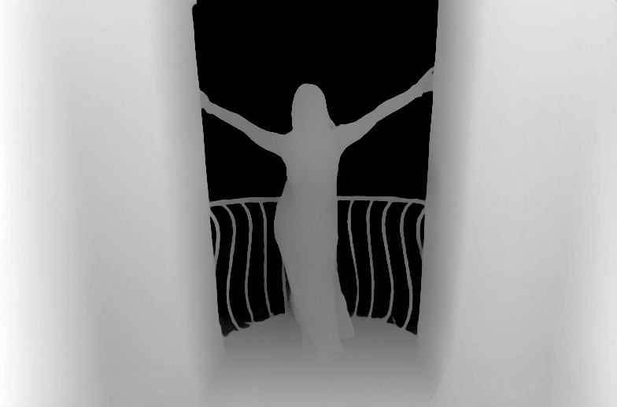
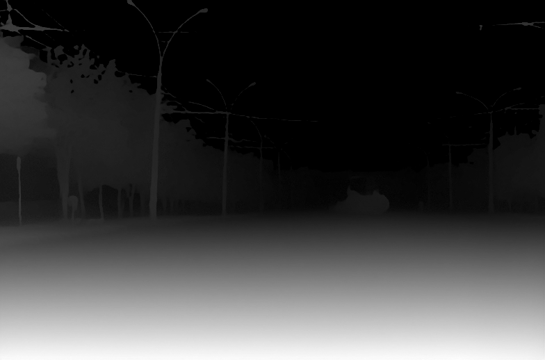

# Frozen two-photo extension — 2026-10-10

This continues [#172](https://github.com/twangyal/projects-monorepo/issues/172), which remains open. The intended outcome is useful automatic depth for editable photo simulations. This intermediate evaluation broadens the indoor-room smoke with a real outdoor street and a portrait; it does not enable product inference or establish readiness.

## Input-only labels and provenance

An independent reviewer inspected only the two 1200×800 source previews, selected five clear near/far comparisons and three thin-boundary diagnostics per photo, and recorded [independent-source-labels.json](independent-source-labels.json). The coordinator reviewed their geometric plausibility against the source images before freezing. The reviewer had no model output or prior smoke labels. These are human visual judgments, not measured depth ground truth or two independent annotators' agreement.

[The issue freeze](https://github.com/twangyal/projects-monorepo/issues/172#issuecomment-6098336480) precedes both first inferences. [frozen-portrait.json](frozen-portrait.json) SHA256 `b076eb4d8734b9aadda2d855d9fbd8bfd6607ef0e454197ce03b4bfbbfcd179f` and [frozen-street.json](frozen-street.json) SHA256 `1efbded1f2053ceb3bff83b1da23f1540f4e3bf73527e30b8d992b3f38692bd0` retain every point, rationale, category and artifact hash. Label receipt SHA256 is `7665271c7211b79365e3cf34224e5b6819464f3434abdabae10f1068ab7a1fdf`. No points, categories, thresholds, preprocessing or model were tuned after output.

Both source-file descriptions declare CC0-1.0, verified2026-10-10:

| Input | Author and source | Original size | SHA256 |
| --- | --- | --- | --- |
| Portrait | [Wendelin Jacober; source dated2015-09-10](https://commons.wikimedia.org/w/index.php?title=File:Portrait_(CreativeCommons).jpg&oldid=1115647773) | 5472×3648;2,482,488bytes | `d237bbf13f886b69a376aad00836403dafdb8a6be0062dc98a50e1a6c7b32a48` |
| Street | [Sergej Majboroda via Poly Haven; page dated2020-10-02](https://commons.wikimedia.org/w/index.php?title=File:Backdrop_-_Wide_Street_01_-_DSC_4389_RAW-Export_(Sergej_Majboroda_via_Poly_Haven).png&oldid=1074905689) | 5568×3712;105,373,861bytes | `a85bdf0ad5d91c88cf9b4a07dc2b61530348cacdedda791680e59a88ef6c16dd` |

The street's embedded capture date differs from its source-page date. Original files and model weights are downloaded locally, not bundled into the app/repository. Their URLs are frozen in the manifests. Previously public images could overlap training; this is not a training-disjoint benchmark. The selected Small ONNX artifact, license and preprocessing remain exactly those in the [parent checkpoint](../README.md).

## Actual results and limits

Each1280×853 normalized input becomes `[1,3,518,784]`; output is real float32 affine-invariant inverse depth `[1,518,784]`. Larger values predict nearer regions, not calibrated meters. Median3×3 samples and strict `near > far` are unchanged; ties fail. Report the two predeclared categories separately:

| Input | Clear ordinal pairs | Diagnostic pairs | First primary inference ms | Final primary inference ms | Final Linux peak process RSS KiB |
| --- | --- | --- | --- | --- | --- |
| Portrait | 5/5 | 3/3 | 3535,3245,2423 | 20541,15439,4954 | 699596 |
| Street | 5/5 | 2/3 | 3254,3508,3949 | 5922,4761,5960 | 705624 |

The unpainted all-subject mask analytically ties every comparison and scores0 strict correct; manually authored masks and correction effort were not measured. Sparse diagnostic pairs are not contour accuracy, segmentation quality or an acceptance score. Do not combine their count with clear pairs to claim readiness.

The **overhead wire ties sky at0**. Several distant portrait sample values also equal0. The visualizations suggest useful coarse scene ordering but do not resolve distant geometry or establish usable subject edges. These observations need correction/perspective-edit evaluation; do not invert zero values into physical distance.




Three repeats in each first and final process produce exactly matching raw hashes. Independent fresh-process repeats on the same host reproduce every raw/PNG hash and pair value: [portrait](independent-portrait.json), [street](independent-street.json). Independent latency observations are7808/9662/15528ms and11347/16654/11311ms respectively. Host load was not isolated and some verification processes overlapped; no causal latency attribution or cross-device guarantee is justified. Peak RSS includes the full process, source decoding, preprocessing and runtime; it is not model-only memory. Runtime: Python3.12.14, ONNX Runtime1.23.2 CPUExecutionProvider, NumPy2.3.5, Pillow12.3.0, x86_64, four intra-op/one inter-op threads. External timeout90 bounds each experiment, not product cancellation.

[first/](first/) preserves literal first receipts/logs. Review caught inherited receipt wording describing one implementer's labels; final source now records the frozen annotation explicitly and uses general visual-label limitations. Final-source reruns preserve raw hashes, PNGs and all samples exactly. This metadata correction does not change the frozen protocols or erase first evidence. First/reviewer receipts can retain that historical wording; manifests and source-only label receipt record the actual process. Final [portrait](portrait-result.json) and [street](street-result.json) receipts each match their literal inference log.

## Reproduce and verify

Install the parent measured research requirements in a separate Python environment; no product dependencies changed. Download the same pinned model and each manifest's exact original-photo URL. The street original is100.49MiB. Verify source checksums deliberately; do not update frozen hashes to admit changed downloads.

```sh
# From repository root, with local model and original photo files already present:
timeout 90 /tmp/lens-depth-env/bin/python docs/research/lens-depth-baseline/evaluate.py --model /tmp/lens-depth-model.onnx --preprocessor docs/research/lens-depth-baseline/preprocessor_config.json --photo /tmp/lens-depth-portrait.jpg --manifest docs/research/lens-depth-baseline/extension-2026-10-10/frozen-portrait.json --manifest-sha256 b076eb4d8734b9aadda2d855d9fbd8bfd6607ef0e454197ce03b4bfbbfcd179f --output /tmp/portrait-result.json
timeout 90 /tmp/lens-depth-env/bin/python docs/research/lens-depth-baseline/evaluate.py --model /tmp/lens-depth-model.onnx --preprocessor docs/research/lens-depth-baseline/preprocessor_config.json --photo /tmp/lens-depth-street.png --manifest docs/research/lens-depth-baseline/extension-2026-10-10/frozen-street.json --manifest-sha256 1efbded1f2053ceb3bff83b1da23f1540f4e3bf73527e30b8d992b3f38692bd0 --output /tmp/street-result.json
/tmp/lens-depth-env/bin/python -m unittest discover -s docs/research/lens-depth-baseline -p 'test_*.py' -v
```

The bounded extension loader requires both manifest flags, checksum-checks the protocol before any model/photo access, and validates1–64 pairs and finite two-coordinate points in `[0,1)`. Four test-first regressions pass; [red log](manifest-tests-red.log) retains the initial four missing-loader failures, and [green log](manifest-tests-green.log) retains passing results. [Actual CLI refusal](changed-manifest-refusal.log) confirms a changed protocol exits1 without model/photo access, receipt or preview. This is an offline research tool, not an admission/security policy for arbitrary product model uploads.

[Original compatibility rerun](original-compatibility-result.json) reproduces the old smoke's exact raw/PNG hashes and every pair using the default original protocol. Original frozen manifest, baseline receipts, images and source preprocessor bytes remain unchanged. Research inference and unit commands ran locally; hosted application CI does not execute ONNX or establish quality.

## Readiness decision and next work

Continue evaluating this candidate, **do not enable it in the product yet**. Clear ordinal ordering is promising on two additional inputs, but these public visual judgments cannot establish generalization. Quantitative subject-boundary labels, correction effort and actual useful perspective edits remain unmeasured. Transparency/reflection coverage is insufficient. Actual browser inference, model acquisition/progress, cancellation/stale-result protection, and resource behavior remain unverified. A deliberate editable-depth/subject-anchor representation is still needed; affine inverse values cannot be relabeled the three-plane editor's physical distances. Generated missing surfaces remain separate work. Lens stays ACTIVE and #172 stays open.
